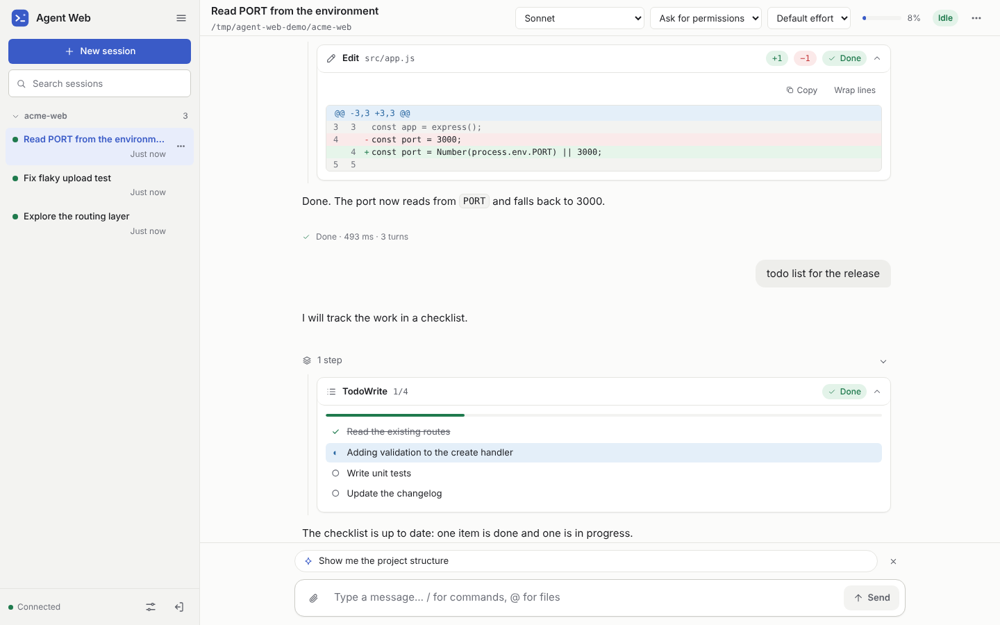
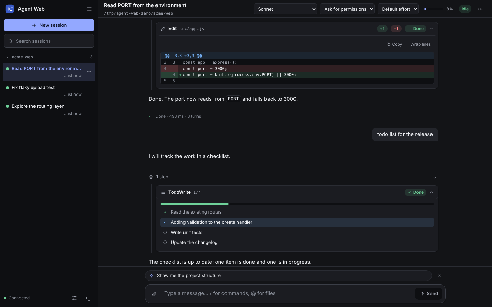
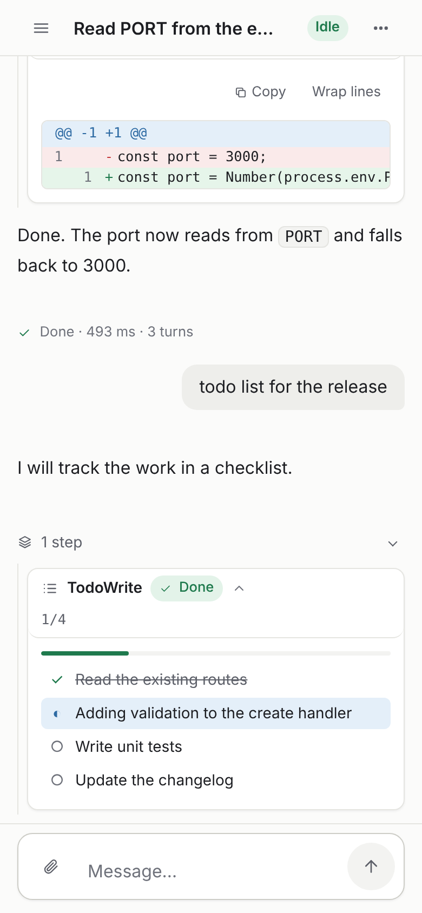

[English](README.md) · 简体中文

# claude-official-web

一个可自托管的图形化 Web 宿主，用于运行官方 Claude Agent SDK。它使用与 `claude` 终端相同的 Claude Code 运行时，因此你的 CLAUDE.md、设置、权限规则、钩子、技能、插件、MCP 服务器、子代理和会话文件，在这里的表现与在终端中完全一致。

## 截图







## 这是什么

claude-official-web 由两部分组成：

- **网关**是一个 Node.js 进程。它负责检查你的登录状态、提供界面，并把请求转发给官方 Claude Agent SDK（`@anthropic-ai/claude-agent-sdk` 0.3.295）。
- **引擎**是 SDK。它会为每个运行中的会话启动官方 Claude Code 运行时（2.1.295）。每一条回复、每一次工具调用、每一个权限决定和每一处文件改动，都由 Claude Code 本身产生。网关只负责传输和展示这些内容。

界面在浏览器中呈现对话、审批卡片和会话工具。它还可以附加一个终端标签页，但只有在你需要时才开启。

由于引擎就是 Claude Code，会话与终端使用的是同一批文件，保存在 `~/.claude/projects` 中。在浏览器中开始的会话，可以用 `claude --resume <id>` 在终端中继续；反过来也一样。

claude-official-web 是一个独立项目，与 Anthropic 没有关联，也未获得 Anthropic 的认可或赞助。界面不会自称为 Claude Code，也不使用 Claude Code 的品牌标识。产品名称可以配置（`CAW_APP_NAME`，默认值为 `Agent Web`）。

## 功能

这里只是概览。每项功能对应的 SDK 调用或消息，完整对照见 [docs/FEATURES.md](docs/FEATURES.md)。

- **对话：** 流式回复、可折叠的思考过程、Markdown 与代码、覆盖所有工具类别的工具卡片（编辑操作会显示差异）、嵌套在父卡片中的子代理、后台任务、中断、排队消息、上下文压缩和上下文用量。
- **审批：** 权限卡片（允许一次、始终允许，或拒绝并填写原因）、对 AskUserQuestion 的回答、计划审批、MCP 信息征询（elicitation）、权限模式，以及模型和推理强度（effort）的切换。“始终允许”会保存勾选的建议：允许规则和仅限本会话的模式切换默认勾选，目录授权等其他变更只有在你勾选后才会保存。
- **会话：** 启动、恢复、重命名、添加标签、分叉、回退代码或对话、删除、分页查看历史记录，以及按项目分组的会话列表。
- **输入：** Claude Code 的斜杠命令（技能、自定义命令和 MCP 提示词，以及无需终端即可使用的内置命令）、`@` 文件引用、图片和文件附件，以及提示词建议。
- **工作区与文件夹信任：** 带目录浏览器的允许根目录，每个路径都会与这些根目录进行检查。只有在你信任某个文件夹之后，其项目设置、钩子、技能、CLAUDE.md 和 MCP 服务器才会加载。
- **扩展：** MCP 服务器的状态、开关和重连；插件与技能的重新加载；文件夹受信任后，CLAUDE.md、设置、钩子和插件的加载方式与终端中完全相同。
- **运维：** 令牌登录（默认以哈希形式保存）、健康检查端点、结构化日志、systemd 服务安装器，以及验证套件（`npm run seal`）。
- **终端备用方案（可选）：** 一个终端标签页，用于运行那些只存在于终端中的命令。

## 要求

- Linux 或 macOS。生产环境安装器管理的是 systemd 用户服务，因此它在 Linux 上运行。在 macOS 上，请使用 `npm start` 运行网关。
- Node.js 22.12 或更高版本。
- Claude 订阅或 Anthropic API 密钥。参见[用量和计费](#用量和计费)。
- 在服务器上，以运行网关的同一用户身份登录一次 Claude Code。SDK 自带 Claude Code 可执行文件，因此网关无需单独安装。登录方法：以该用户身份运行一次 `claude`（或 `npx @anthropic-ai/claude-code`），然后完成 `/login`。
- 仅终端标签页需要：`build-essential` 和 `python3`，node-pty 编译时需要它们。

## 快速演示

无需账户。演示使用内置的模拟引擎：

```bash
npm ci
npm run demo
```

打开 <http://127.0.0.1:4180>。演示没有登录步骤，因此只能在你自己的机器上运行，切勿暴露到网络上。

## 生产环境安装（Linux）

1. 以将要运行服务的用户身份登录 Claude Code，并完成 `/login`（参见[要求](#要求)）。
2. 将项目克隆或解压到 `~/claude-official-web`，然后在该目录中运行安装器。如果你打算通过域名访问网关，请先设置来源地址：

   ```bash
   cd ~/claude-official-web
   CAW_PUBLIC_ORIGIN=https://claude.example.com scripts/install-linux.sh
   ```

安装器会检查 Node.js、安装生产依赖、创建配置文件、安装并启动 systemd 用户服务，然后等待健康检查通过。重复运行是安全的：它会保留你的配置和登录令牌，并更新依赖和服务单元。它还会重启正在运行的服务以应用配置；在默认的哈希模式下，这会让所有浏览器退出登录。

**登录令牌只显示一次。** 新安装会生成一个令牌，并只把它的 SHA-256 哈希以 `CAW_TOKEN_SHA256` 的形式保存在配置文件中。安装器打印令牌时，请立即把它保存到密码管理器中。配置文件无法再次显示该令牌。如果你丢失了它，请运行 `scripts/install-linux.sh --rotate-token`。请在你自己的终端中运行安装器，而不要通过 Claude Code 运行，这样打印出的令牌就不会进入会话记录。

配置文件位于 `~/.config/claude-official-web/env`（权限为 600）。修改配置后，运行 `systemctl --user restart claude-official-web`。

```bash
systemctl --user status claude-official-web
systemctl --user restart claude-official-web
journalctl --user -u claude-official-web -f
loginctl enable-linger "$USER"                 # 退出登录后保持服务运行
scripts/install-linux.sh --rotate-token        # 签发新的登录令牌；所有浏览器需要重新登录
scripts/install-linux.sh --uninstall           # 移除服务，保留配置
scripts/install-linux.sh --uninstall --purge   # 同时移除配置和令牌
```

安装器还接受以下选项：

- `--plain-token` 把新签发的令牌以明文（`CAW_TOKEN`）保存，而不是保存哈希。只有当配置文件必须能够显示该令牌时才使用它。
- `--rotate-token` 签发新的令牌，并以相同方式保存（使用 `--plain-token` 时则以明文保存），然后重启服务。所有浏览器会话都会结束。
- `--show-token` 打印本次运行签发的令牌，或已保存的明文令牌。已保存的哈希无法显示。
- `--allow-root`（不推荐）和 `--help`。

在安装任何内容之前，安装器会检查现有配置。它会拒绝同时设置两个令牌变量的文件、长度不足 16 个字符的明文令牌、格式错误的哈希、`CAW_REQUIRE_AUTH=0` 或 `CAW_ENGINE=mock`，并指出需要修改的配置项。`--rotate-token` 会跳过令牌检查，因为它会替换已保存的令牌。

[docs/DEPLOYMENT.md](docs/DEPLOYMENT.md) 中的部署指南涵盖完整的服务器部署、更新和备份。

## 远程访问

只通过 HTTPS 对外提供网关，切勿直接发布其端口。请从以下方案中选择一种：

- **Cloudflare Tunnel 加 Cloudflare Access（公共域名推荐）。** 隧道转发到 `http://127.0.0.1:4180`。Access 会先要求身份验证，然后才会考虑令牌。
- **Tailscale。** `tailscale serve --bg --https=443 127.0.0.1:4180` 只会把网关发布到你的 tailnet。
- **你自行运营的 TLS 反向代理**，例如 Caddy 或 nginx。流式传输要求关闭响应缓冲。部署指南中的示例已做此设置。

无论选择哪一种，都要把 `CAW_PUBLIC_ORIGIN` 设置为浏览器地址栏中显示的确切来源：包括协议、主机和端口，不带路径，也不带末尾斜杠。来自其他来源的写操作会被以 `ORIGIN_REJECTED` 拒绝。网关只接受 `Host` 请求头为该主机或回环名称的请求，因此代理必须原样转发 `Host` 请求头，否则网关会返回 `421 HOST_REJECTED`。

在同一台主机上的代理或隧道之后，请设置 `CAW_TRUST_PROXY=1`，使每位访问者各自拥有登录和流数量限制。设置之前请先阅读部署指南：只有当代理自行设置客户端地址请求头时，这样做才是安全的。

## 配置

网关从环境变量读取所有设置。生产服务则从配置文件中读取这些设置。

| 变量 | 默认值 | 说明 |
|---|---|---|
| `CAW_HOST` | `127.0.0.1` | 网关监听的地址。请保持在回环地址上，并通过 HTTPS 对外发布。 |
| `CAW_PORT` | `4180` | 网关监听的端口。 |
| `CAW_REQUIRE_AUTH` | `1` | `1` 表示要求登录令牌。`0` 会关闭登录，且只有在 `CAW_HOST` 为回环地址时才被接受；安装器会拒绝它。 |
| `CAW_TOKEN` | 无 | 明文登录令牌，16 到 1024 个字符。与 `CAW_TOKEN_SHA256` 二选一，不能同时设置。`--plain-token` 会写入它。 |
| `CAW_TOKEN_SHA256` | 无 | 登录令牌的 SHA-256，为 64 个十六进制字符。安装器默认写入此项。 |
| `CAW_PUBLIC_ORIGIN` | 未设置 | 用户打开的规范来源，例如 `https://claude.example.com`。在代理或隧道之后使用时请设置。 |
| `CAW_ACCESS_PROFILE` | `full` | `read`（仅查看）、`standard`（除删除会话、终端和绕过模式外的全部功能）或 `full`。 |
| `CAW_APP_NAME` | `Agent Web` | 界面中显示的产品名称。 |
| `CAW_WORKSPACE_ROOTS` | `$HOME` | 以冒号分隔的已存在目录，会话可以在其中启动，目录浏览器也只浏览其中的内容。建议使用项目目录。它限制的是会话，而不是智能体。 |
| `CAW_STATE_DIR` | `~/.local/state/claude-official-web` | 网关的状态目录，其中保存会话撤销记录和受信任的文件夹。 |
| `CAW_ENGINE` | `sdk` | `sdk` 通过 Agent SDK 运行 Claude Code。`mock` 选择内置的演示引擎；安装器会拒绝它。 |
| `CAW_CLAUDE_BIN` | 未设置（使用 SDK 自带的可执行文件） | Claude Code 可执行文件的绝对路径，用于对话和终端会话，代替自带版本。设置后不会回退到其他版本。 |
| `CAW_DEFAULT_MODEL` | 未设置（Claude Code 的默认值） | 新会话使用的模型。 |
| `CAW_DEFAULT_PERMISSION_MODE` | `default` | 新会话使用的权限模式。`bypassPermissions` 需要 `CAW_ALLOW_BYPASS=1` 和 `full` 档位。 |
| `CAW_DEFAULT_EFFORT` | 未设置（Claude Code 的默认值） | 新会话使用的推理强度：`low`、`medium`、`high`、`xhigh` 或 `max`。 |
| `CAW_TERMINAL` | `0` | `1` 启用终端标签页。它需要 `full` 档位和 node-pty，并且等同于 shell 访问权限。 |
| `CAW_ALLOW_BYPASS` | `0` | `1` 允许使用 `bypassPermissions` 模式，包括作为默认模式。它需要 `full` 档位。 |
| `CAW_IDLE_TIMEOUT_MS` | `1800000`（30 分钟） | 空闲的运行中会话会在此时间后关闭，并在你发送下一条消息时恢复。 |
| `CAW_MAX_LIVE_SESSIONS` | `4` | 同时运行的 Claude Code 进程数量上限。 |
| `CAW_UPLOAD_MAX_BYTES` | `26214400`（25 MiB） | 允许的最大附件大小。 |
| `CAW_IMAGE_MAX_BYTES` | `5242880`（5 MiB） | 允许的最大图片附件大小。 |
| `CAW_UPLOAD_RETENTION_DAYS` | `7` | 网关创建的附件批次会在此天数后被删除。 |
| `CAW_SESSION_TTL_HOURS` | `168`（7 天） | Web 登录会话的有效时长，单位为小时。 |
| `CAW_TRUST_PROXY` | `0` | `1` 表示按 `CF-Connecting-IP`、`X-Real-IP`、最后一个 `X-Forwarded-For` 条目的顺序获取客户端地址。只有当网关只能通过一个自行设置这些请求头之一的代理访问时才使用。 |
| `CAW_LOG_LEVEL` | `info` | `debug`、`info`、`warn` 或 `error`。 |
| `CAW_MOCK_DELAY_MS` | `12` | 模拟输出中相邻词元之间的延迟。仅对模拟引擎有效。 |

## 安全模型

完整的威胁模型和控制措施清单见 [SECURITY.md](SECURITY.md)。简要来说：

- 只有一个操作者和一个登录令牌。令牌用于登录，之后的会话由 HttpOnly、SameSite=Strict 的 Cookie 维持。安装器只保存令牌的 SHA-256 哈希，因此配置文件无法用于登录。如果你想使用自己选择的令牌，请运行以下命令计算其哈希，然后把输出的 64 个字符填入 `CAW_TOKEN_SHA256`：

  ```bash
  read -r -s -p "Login token: " TOKEN && echo
  printf '%s' "$TOKEN" | sha256sum | cut -d' ' -f1    # macOS：shasum -a 256 | cut -d' ' -f1
  unset TOKEN
  ```

- 每个请求都必须带有允许的主机名：回环名称（`127.0.0.1`、`localhost` 或 `[::1]`）或 `CAW_PUBLIC_ORIGIN` 的主机。其他主机名会得到 `421 HOST_REJECTED`，这可以阻止 DNS 重绑定攻击。
- 每一次写操作都必须来自已配置的来源。这可以阻止跨站请求和跨站 WebSocket 劫持。
- 在默认的哈希模式下，网关重启时会话即告结束，安装器运行之后也是如此。使用明文 `CAW_TOKEN` 时，会话可以跨重启保留。两种模式下，退出登录的效果都会在重启后保持。
- 登录有速率限制：同一客户端地址在十分钟内失败十次即被限制。事件流最多同时打开 64 个，每个客户端地址最多 16 个。请求正文停止到达 30 秒后，连接会被关闭；对 Claude Code 的控制调用会在 10 秒后超时。
- 文件夹信任：未受信任的文件夹只使用你的用户设置运行。只有在读过文件夹内容之后，才应信任它。
- 网关从不读取 Claude 凭据。它会从 Claude Code 的环境变量中移除登录令牌和每一个 `CAW_*` 变量。
- 模型输出是不可信的。Markdown 会经过净化，工具输出以纯文本形式显示。
- 权限决定由 Claude Code 自身做出。只批准你已经读过的内容：被批准的命令会以服务用户的全部权限运行。

## 终端备用方案

有些 Claude Code 功能只存在于终端中：`/theme`、`/terminal-setup`、Vim 模式、自定义按键绑定、`!` shell 模式、`/resume` 和 `/config` 等全屏选择器，以及 `/login`。可选的终端标签页会在伪终端中运行 Claude Code。它可以附加到某个会话（`claude --resume <id>`），也可以在某个项目中启动一个新的 `claude`。

启用方法：设置 `CAW_TERMINAL=1`。它需要 `full` 档位，并且需要构建 node-pty，这要求安装 `build-essential` 和 `python3`。终端等同于服务用户的 shell，因此只能在仅由你一人操作的主机上启用。终端附加到某个会话期间，浏览器无法写入该会话；分离终端后，即可在浏览器中继续操作。

设置了 `CAW_CLAUDE_BIN` 时，终端运行的是该路径下的可执行文件，且不会回退。否则，终端运行 SDK 自带的原生二进制文件；只有当它缺失时，才会运行 `PATH` 中第一个可执行的 `claude`。

## 会话与终端

在浏览器中开始的会话与终端会话一样，保存在 `~/.claude/projects` 中。要在终端中继续某个会话，请使用其会话 ID 运行 `claude --resume <id>`。由 SDK 创建的会话可能不会出现在 Claude Code 交互式的 `/resume` 选择器中，因此请直接使用会话 ID。

## 用量和计费

Anthropic 帮助中心的说明原文如下：

> You can still use the Claude Agent SDK, `claude -p`, and third-party apps with your subscription limits.

译文：你仍然可以在订阅额度内使用 Claude Agent SDK、`claude -p` 和第三方应用。

来源：[Use the Claude Agent SDK with your Claude plan](https://support.claude.com/en/articles/15036540-use-the-claude-agent-sdk-with-your-claude-plan)。

Agent SDK 文档还补充了以下说明：

> Unless previously approved, Anthropic does not allow third party developers to offer claude.ai login or rate limits for
> their products, including agents built on the Claude Agent SDK. Use the API key authentication methods described in the
> Quickstart instead.

译文：除非事先获得批准，Anthropic 不允许第三方开发者为其产品提供 claude.ai 登录或速率限制，包括基于 Claude Agent SDK 构建的智能体。请改用快速入门中介绍的 API 密钥认证方法。

来源：[Agent SDK overview](https://code.claude.com/docs/en/agent-sdk/overview)。

这对你意味着：

- claude-official-web 面向**个人自托管**。你在自己控制的服务器上，使用自己的登录，为自己运行网关。
- 如果你要让其他人使用，或为团队或客户运行网关，请不要共享 claude.ai 登录。请按照 Agent SDK 快速入门的说明，使用 Anthropic API 密钥。
- 每一轮对话都会使用你登录的账户，并计入该账户的额度或计费。

## 开发

```bash
npm ci
npm run dev            # 模拟引擎，修改后自动重启，无需登录
npm test               # 单元测试和集成测试
npm run test:e2e       # 22 个浏览器测试；请先安装 Chromium：npx playwright-core install chromium
npm run typecheck      # 对 JSDoc 类型运行 tsc
npm run check          # 对整个代码树运行静态规则检查
npm run seal           # 运行上述检查并验证源码清单；写入 .state/seal-receipt.json
```

其他脚本包括：`npm run manifest` 和 `npm run manifest:verify`（源码清单）；`npm run smoke:runtime` 和 `npm run smoke:gateway`（真实引擎与已部署网关的验证，参见 [docs/PRODUCTION_SEAL.md](docs/PRODUCTION_SEAL.md)）；`npm run screenshots`（使用 Chromium 渲染 `docs/screenshots` 中的图片）；以及 `npm run maintenance:prune`（删除过期附件）。

目录结构如下：

- `src/`：Node.js 网关（带 `// @ts-check` 的 ES 模块）。
- `public/`：浏览器界面（原生 ES 模块，没有打包器）。
- `test/unit`、`test/integration`、`test/e2e`：测试套件。`test/e2e` 使用 Chromium 运行。
- `scripts/`：验证流程、静态检查、冒烟测试和安装器。
- `deploy/`：systemd 用户单元模板。
- `docs/`：部署、功能、验证、协议、前端和工程文档。

契约文档见 [ARCHITECTURE.md](ARCHITECTURE.md)、[docs/PROTOCOL.md](docs/PROTOCOL.md)、[docs/FRONTEND.md](docs/FRONTEND.md) 和 [docs/ENGINEERING.md](docs/ENGINEERING.md)。依赖版本精确固定，新增依赖需要经过架构决策。

## 故障排查

| 症状 | 原因 | 处理方法 |
|---|---|---|
| `ENGINE_UNAVAILABLE`（HTTP 503），或会话中出现此代码的通知 | 运行网关的用户尚未登录 Claude Code，找不到其可执行文件，或会话期间其登录被拒绝 | 以该用户身份运行 `claude` 并完成 `/login`，然后重新打开会话。如果找不到可执行文件，请设置 `CAW_CLAUDE_BIN`。修改配置后重启服务。 |
| `HOST_REJECTED`（HTTP 421） | `Host` 请求头既不是回环名称，也不是 `CAW_PUBLIC_ORIGIN` 的主机。通常是没有设置 `CAW_PUBLIC_ORIGIN`，或代理改写了 `Host` | 将 `CAW_PUBLIC_ORIGIN` 设置为浏览器中的访问地址，让代理原样转发 `Host`（nginx 中为 `proxy_set_header Host $host;`），然后重启服务。 |
| `ORIGIN_REJECTED` | 浏览器的来源与 `CAW_PUBLIC_ORIGIN` 不一致，这在代理或隧道之后很常见 | 将 `CAW_PUBLIC_ORIGIN` 设置为地址栏中的确切来源，然后重启服务。 |
| `INVALID_TOKEN`（HTTP 401） | 登录令牌与配置的令牌不符 | 输入安装器打印的令牌。如果已经丢失，请在你自己的终端中运行 `scripts/install-linux.sh --rotate-token`。所有会话都会结束。 |
| `RATE_LIMITED`（HTTP 429） | 同一客户端地址的登录失败次数过多 | 等待 `Retry-After` 指定的时间。在没有设置 `CAW_TRUST_PROXY=1` 的代理之后，所有访问者共用一个计数。 |
| `TOO_MANY_STREAMS`（HTTP 429） | 同一客户端地址的事件流超过 16 个，或总数超过 64 个 | 关闭其他网关标签页。在没有设置 `CAW_TRUST_PROXY=1` 的代理之后，所有访问者共用同一限制。 |
| `SESSION_LOCKED` | 终端标签页持有该会话 | 退出终端会话或将其分离。浏览器即可再次写入。 |
| `TOO_MANY_SESSIONS` | 所有运行槽位都已占用 | 等待某个会话变为空闲，或提高 `CAW_MAX_LIVE_SESSIONS`。每个运行中的会话都是一个独立进程。 |
| 浏览器要求重新登录 | 服务已重启。哈希模式下，会话密钥只存在于内存中，因此每次重启（包括安装器运行）都会结束会话 | 重新登录。使用明文 `CAW_TOKEN` 时，会话可以跨重启保留。 |
| 会话显示未受信任文件夹的横幅 | 该文件夹尚未受信任，因此其项目钩子、MCP 服务器和 CLAUDE.md 不会加载 | 通过横幅信任该文件夹。会话会以项目设置重新启动。 |
| 安装器拒绝当前配置 | 文件中包含生产服务不接受的设置，例如同时设置了两个令牌变量 | 修改 `~/.config/claude-official-web/env` 中指出的配置项。`--rotate-token` 会替换已保存的令牌设置。 |
| 终端标签页提示 node-pty 缺失 | 安装时没有编译 node-pty | 安装 `build-essential` 和 `python3`，然后重新运行 `scripts/install-linux.sh`。 |
| 通过 nginx 访问时回复中途停止 | 事件流被响应缓冲，或超时时间过短 | 为网关所在的 location 设置 `proxy_buffering off` 和 `proxy_read_timeout 3600s`。 |
| 退出登录后服务停止 | 未为该用户启用 lingering（即退出登录后仍保持服务运行） | 运行 `loginctl enable-linger "$USER"`。 |
| 服务无法启动 | 配置错误，或缺少 Node.js | 运行 `journalctl --user -u claude-official-web -n 100 --no-pager`。退出状态 2 表示配置错误；请修改日志中提到的变量。 |

## 许可证

MIT。参见 [LICENSE](LICENSE)。
